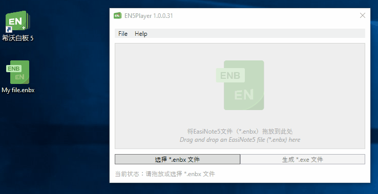

# EN5Player
**[EN5Player](https://github.com/Iron-YeHong/EN5Player/blob/master/README.md)** is a tool designed to show EasiNote5 files(*.enbx) directly without the installation of EasiNote5. It wraps an EasiNote5 file(*.enbx) to an executable file(*.exe), which is natively supported in any windows computers. With this tool, users are free to distribute their *.enbx files without worrying about whether the recipient has EasiNote5 software installed.  
**EasiNote5** is a teaching software, which provides abundant teaching tools and resources to greatly improve the teacher's efficiency of lesson preparation and enhance the interactivity of classroom. More about EasiNote5: http://easinote.seewo.com.

## Related Technologies
- [Self-extracting archive](https://en.wikipedia.org/wiki/Self-extracting_archive)   
A self-extracting archive (SFX/SEA) is a computer executable program which contains compressed data in an archive file combined with machine-executable program instructions to extract this information on a compatible operating system and without the necessity for a suitable extractor to be already installed on the target computer. The executable part of the file is known as the stub and the non-executable part the archive.
- [DotNetZip](https://github.com/Iron-YeHong/DotNetZip.Semverd)  
DotNetZip is a FAST, FREE class library and toolset for manipulating zip files. Use VB, C# or any .NET language to easily create, extract, or update zip files.
- [MSBuild Community Tasks](https://github.com/loresoft/msbuildtasks)  
The MSBuild Community Tasks Project is an open source project for MSBuild tasks.
- [CSharpCodeProvider](https://docs.microsoft.com/en-us/dotnet/api/microsoft.csharp.csharpcodeprovider?view=netframework-4.7.1)  
Provides access to instances of the C# code generator and code compiler.
- [supportedRuntime](https://docs.microsoft.com/en-us/dotnet/framework/migration-guide/how-to-configure-an-app-to-support-net-framework-4-or-4-5)  
If the application configuration file includes \<supportedRuntime\> entries that specify one or more .NET Framework versions, and one of those versions is present on the user's computer, the app runs on that version. 

## Usage

